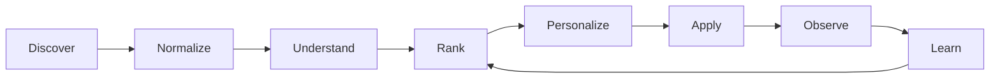
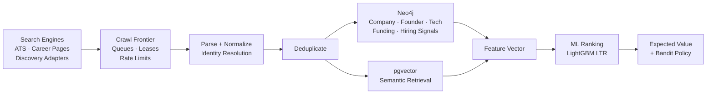
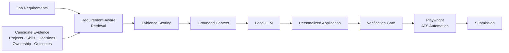
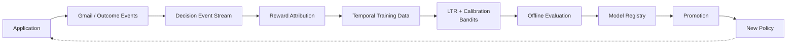
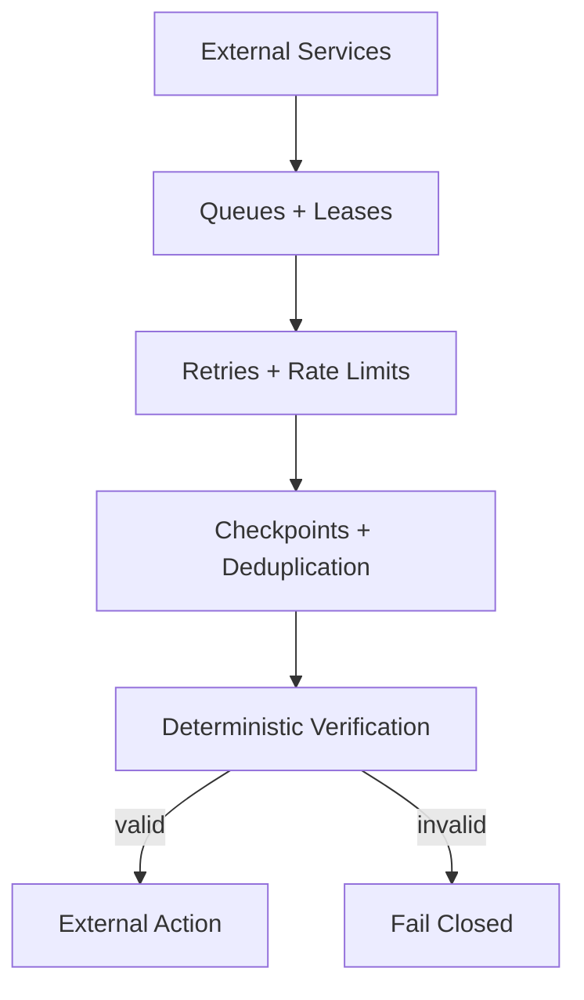

> [!IMPORTANT]
> **A note to recruiters:** If you somehow ended up here, hello. Yes, I built an entire job-search engine to automate the process of finding you. If HO [Hyperdimensional Orchestrator] applied to your company, congratulations your ATS has officially become part of my distributed systems experiment.

</br>

<div align="center">

  

</div>

</br>

## Introduction

HO (Hyperdimensional Orchestrator) is an in-house, self-learning job application engine I built because existing job platforms are fundamentally static: they search a limited set of sources, rank jobs with fixed rules, and generate largely generic applications.

HO treats the entire process as a feedback loop. It discovers jobs across the web, normalizes and enriches them, matches them against my actual experience, ranks them using ML and graph signals, generates job-specific application content, automates the application, and feeds the resulting outcomes back into the system.

The goal is not simply to apply to more jobs. It is to continuously learn which jobs, companies, sources, queries, and application strategies actually produce better outcomes.

Discord acts as the control plane rather than the intelligence layer. It provides a lightweight interface for reviewing opportunities, monitoring applications, receiving outcome notifications, and interacting with the system without requiring a separate dashboard.

## Performance

HO is designed as an asynchronous, worker-based pipeline where discovery and intelligence operate significantly faster than the human-facing application layer.

| Pipeline Stage | Operation                     | Typical / min |     Peak / min | Unit             |
| -------------- | ----------------------------- | ------------: | -------------: | ---------------- |
| Discovery      | Web URLs discovered           |   **10,000+** |    **25,000+** | URLs/min         |
| Discovery      | Job postings fetched          |    **2,000+** |     **5,000+** | jobs/min         |
| Parsing        | Job postings parsed           |    **1,500+** |     **4,000+** | jobs/min         |
| Normalization  | Jobs canonicalized            |    **1,500+** |     **4,000+** | jobs/min         |
| Deduplication  | Duplicate candidates checked  |   **10,000+** |    **50,000+** | candidates/min   |
| Embeddings     | Documents embedded            |    **1,000+** |     **2,500+** | texts/min        |
| Vector Search  | Semantic retrievals           |    **5,000+** |    **15,000+** | queries/min      |
| Graph          | Entities enriched             |    **2,000+** |     **5,000+** | jobs/min         |
| Features       | Feature vectors generated     |    **5,000+** |    **15,000+** | candidates/min   |
| LTR            | Candidates ranked             |  **100,000+** |   **500,000+** | candidates/min   |
| Calibration    | Predictions calibrated        |  **500,000+** | **1,000,000+** | predictions/min  |
| Bandits        | Policy decisions              |  **100,000+** |   **500,000+** | decisions/min    |
| Event Stream   | Events processed              |   **50,000+** |   **250,000+** | events/min       |
| LLM            | Application content generated |      **5–15** |      **20–30** | applications/min |
| Evidence RAG   | Candidate evidence retrieved  |      **100+** |       **500+** | retrievals/min   |
| Browser        | Forms processed               |     **20–40** |        **60+** | applications/min |
| Submission     | Applications submitted        |     **10–20** |        **30+** | applications/min |
| Feedback       | Gmail outcomes processed      |      **100+** |     **1,000+** | events/min       |

> [!NOTE]
> **Benchmark environment:** Throughput figures were measured on a local deployment running **32 GB DDR5 RAM, Intel Core i7 12th Gen, NVIDIA RTX 3060 6 GB, and a 700 Mbps internet connection**. Figures represent observed subsystem throughput under the benchmark workload; end-to-end throughput varies by pipeline path and workload composition.

The system is intentionally bottlenecked at the application layer rather than the discovery layer. Discovery, parsing, retrieval, graph enrichment, and ranking can operate substantially faster than the comparatively expensive process of generating, verifying, and submitting an application.

The real optimization target is not jobs crawled per minute, but **qualified applications and downstream interview/offer outcomes per unit of compute and human attention**.

## What a Run Looks Like

The numbers above describe the system's throughput, but this is what HO actually looks like while running. Discord acts as the operational interface, reporting discoveries, filtering decisions, rankings, applications, and system events as they happen.

A typical two-minute run can produce a substantial stream of opportunities while HO simultaneously parses, deduplicates, enriches, ranks, and queues candidates for application.


The interface is intentionally operational rather than a separate dashboard. HO does the work in the background; Discord exposes what it found, what it decided, and what happened afterward.

## Execution Guide & Commands Reference

### Quickstart

1. **Environment Setup**:
   ```bash
   cp .env.example .env
   ```
2. **Initialize RAG Memory & Resume Indexing**:
   ```bash
   bun run initm
   ```
3. **Run Production Engine**:
   ```bash
   bun run run
   ```

---

### Workspace Commands Summary

All workspace tasks are managed via `bun run <command>`:

| Command | Description |
| :--- | :--- |
| `bun run run` | **Main Production Engine** — Starts infrastructure (Postgres, Redis, Neo4j), discovery, ranking, and Stagehand browser autofill. |
| `bun run status` | **Live Real-Time Dashboard** — Monitors live throughput rates (obs/min, cand/min, fills/min), queue state, worker procs, and ML epochs. |
| `bun run export` | **Export Candidates** — Dumps filtered/accepted jobs to CSV (`packages/ingest/intel/accepted_jobs.csv`). |
| `bun run initm` | **Initialize RAG Memory** — Re-indexes master resume (`resume.pdf` / `RESUME_URL`) into vector memory. |
| `bun run intel` | **Market Intelligence** — Runs competitive hiring radar, salary statistics, and company research. |
| `bun run health` | **Health Diagnostics** — Checks database connections, proxy relays, and container status. |
| `bun run backup` | **System Backup** — Creates gzipped volume snapshots of PostgreSQL and vector indexes. |
| `bun run check` | **Full Quality Check** — Runs Ruff formatting, Ruff linting, MyPy type checking, and test suites. |
| `bun run test` | **Test Execution** — Runs unit & benchmark test suites across Python and Node. |

---

### Command Flags & Detailed Usage

#### 1. `bun run run` (Main Pipeline Runner)
```bash
bun run run [FLAGS]
```
* **`--radar-workers <N>`**: Number of parallel candidate discovery and scoring worker procs (default: `32`).
  ```bash
  bun run run --radar-workers 48
  ```
* **`--bridge-interval <seconds>`**: Interval in seconds between candidate queue drain cycles (default: `10`).
  ```bash
  bun run run --bridge-interval 5
  ```
* **`--bridge-batch <N>`**: Maximum candidates processed per drain batch (default: `20`).
  ```bash
  bun run run --bridge-batch 50
  ```
* **`--max-minutes <N>`**: Hard stop timer after N minutes of continuous operation.
  ```bash
  bun run run --max-minutes 120
  ```
* **`--no-fill`**: Runs job discovery, dorking, and ranking, but skips the autofill browser worker.
  ```bash
  bun run run --no-fill
  ```
* **`--dry-run`**: Starts infrastructure services (Postgres, Redis) to verify health without launching sweeps.
  ```bash
  bun run run --dry-run
  ```

#### 2. `bun run status` (Live TUI Dashboard)
```bash
bun run status [FLAGS]
```
* **`--watch` / `-w`**: *(Default)* Continuously updates the TUI dashboard in real time.
* **`--once`**: Prints a single static snapshot table and exits immediately.
  ```bash
  bun run status --once
  ```

#### 3. `bun run export` (Candidate Exporter)
```bash
bun run export [FLAGS]
```
* **`--eligibility <status>`**: Filter candidates by eligibility status (`accepted` [default], `near_miss`, `rejected`, `all`).
  ```bash
  bun run export -- --eligibility near_miss
  ```
* **`--mode <format>`**: Output schema format (`jobs` [default CSV], `outreach` [founder socials/funding], `all` [full JSON dump]).
  ```bash
  bun run export -- --mode outreach
  ```
* **`--out <path>`**: Specify a custom CSV output file path.
  ```bash
  bun run export -- --out ~/Desktop/accepted.csv
  ```

#### 4. `python -m autofill.src.filling.resume <job_id>`
Resumes filing a deferred application waiting on user input or OTP:
```bash
python -m autofill.src.filling.resume <job_id>
```

---

### Discord Agent Control Plane

Use the following commands directly inside Discord:

* **`/analytics` or `!analytics`**: Generates market intelligence (Pipeline Velocity, Top Companies, Sector Signals, Skill Arbitrage) inside a dedicated thread.
* **`/status` or `!status`**: Displays active queue status, fill counts, and worker health.
* **`/memory` or `!memory`**: Shows currently loaded candidate persona context and indexed resume chunks.
* **`/health` or `!health`**: Runs diagnostic checks on databases and proxy relays.
* **`/stop` or `!stop`**: Gracefully stops active discovery and browser workers.

---

## Architecture

The diagram below shows the complete execution and learning path through HO, from web discovery to application submission and eventual outcome feedback.

It covers the infrastructure layer, discovery frontier, ATS ingestion, canonicalization, Neo4j entity graph, pgvector retrieval, feature engineering, LightGBM learning-to-rank, probability calibration, contextual bandits, candidate evidence retrieval, local LLM generation, Playwright automation, Gmail Pub/Sub feedback, event attribution, offline model training, model promotion, and application-epoch control.

The important architectural property is the feedback loop:

**discover → understand → rank → personalize → apply → observe → learn → improve**

The system is deliberately split between deterministic execution and adaptive intelligence. Hard eligibility constraints and final application verification remain deterministic, while ranking, discovery allocation, query selection, exploration, and expected-value estimation are learned from accumulated outcomes.

The graph is intentionally detailed because the individual components are less interesting in isolation than the relationships between them. A job discovered by one source can influence ranking, generate an application, produce an email event, become a reward signal, affect a future model, and ultimately change which jobs HO chooses to discover next.

# Full System Architecture

## 1. System Overview

HO is an autonomous job-search and application system built around a continuous decision loop rather than a conventional search-and-apply workflow. It discovers opportunities from multiple web and ATS sources, canonicalizes and deduplicates them, evaluates them against my profile, enriches them with company and market intelligence, ranks them, generates grounded application material, and executes applications through browser automation.

The system separates deterministic constraints from adaptive decisions. Eligibility, data integrity, and final submission verification remain deterministic, while discovery allocation, ranking, exploration, query selection, and application prioritization adapt from historical outcomes.



The result is a system that becomes increasingly specific to the candidate and the observed job market instead of relying on static search filters and generic application templates.

## 2. Discovery & Intelligence

HO treats job discovery as an optimization problem. Search engines, ATS endpoints, company career pages, startup databases, technical communities, and other discovery adapters feed a bounded crawl frontier. Static HTTP acquisition is preferred for speed, while browser rendering is reserved for sources that actually require JavaScript or interactive execution.

Discovered postings pass through parsing, normalization, identity resolution, and deduplication before entering the decision surface. The resulting job representation combines structured posting data with semantic similarity, candidate-to-skill relationships, company intelligence, technology overlap, funding signals, freshness, and graph-derived features.



The ranking layer is intentionally separated from discovery. HO can therefore explore new sources and queries without immediately trusting them, while ranking evaluates the resulting opportunities against the candidate's actual probability of producing a useful downstream outcome.

## 3. Personalization & Application Execution

Personalization is built around evidence rather than generic text generation. HO maintains a structured candidate knowledge base containing projects, skills, responsibilities, architectural decisions, technical difficulties, outcomes, and other defensible experience. These are represented as retrievable evidence atoms rather than treating the resume as one large prompt.

For each job, requirements are extracted first. Relevant candidate evidence is then retrieved and scored before being passed to the generation layer. The LLM therefore receives a constrained set of evidence relevant to the specific opportunity instead of being asked to invent an answer from a generic profile.



The final verification layer is deliberately deterministic. The system is allowed to fail an application rather than submit incorrect personal information, unsupported claims, malformed answers, or inconsistent candidate data.

## 4. Feedback, Learning & Adaptation

Every meaningful decision is recorded as an event containing its context, features, action, model and policy versions, source, query, exploration state, and eventual outcome. Application outcomes are collected through Gmail events and other execution signals, then attributed back to the originating job and decision context.

The learning system operates offline before new policies are promoted. LightGBM LambdaMART learns ranking behaviour, calibration converts model scores into meaningful probabilities, expected-value policies estimate whether an opportunity is worth the application cost, and contextual bandits control exploration across sources and queries.



The feedback loop does not assume that every rejection means the underlying job was bad. Outcomes can be delayed, censored, or affected by application execution, timing, eligibility, and other confounding factors. Temporal validation, propensity logging, shadow evaluation, and conservative promotion are therefore used to prevent the system from blindly learning from noisy feedback.

### Reading the Architecture

The system flows primarily from top-level infrastructure into discovery, ingestion, intelligence, personalization, execution, and feedback. The lower sections close the learning loop by converting real-world application outcomes into versioned training data and updated policies.

The most important boundary is between **decision-making and execution**: ML determines which opportunities are worth pursuing and how they should be personalized, while deterministic validation controls what is actually submitted externally.


```mermaid
flowchart TD

HO["<b>HO · SELF-LEARNING JOB APPLICATION ENGINE</b><br/><br/>DISCOVER → NORMALIZE → UNDERSTAND → RANK → PERSONALIZE → APPLY → OBSERVE → LEARN<br/><br/>Python ingestion + ML · TypeScript automation · PostgreSQL/pgvector · Neo4j · Playwright · Gmail Pub/Sub"]

%% ============================================================
%% INFRASTRUCTURE
%% ============================================================

subgraph INFRA["LOCAL INFRASTRUCTURE · DOCKER + NATIVE PROCESSES"]
direction TB

subgraph DOCKER["Docker Compose"]
direction LR

SEARX["<b>SearXNG</b> :8080<br/>Meta-search aggregation<br/>Search-engine result discovery<br/>Query expansion + web discovery"]

TOR["<b>Tor SOCKS5</b><br/>Rotating exits + country pinning<br/>Geo-aware routing<br/>Host-specific proxy policy"]

PG["<b>PostgreSQL + pgvector</b> :5433<br/><br/>jobs · observations · candidates<br/>application queue · persona · memory<br/>decision_events · model_registry<br/>evidence atoms · embeddings<br/>Gmail state · epoch state"]

NEO["<b>Neo4j Community</b> :7687<br/><br/>Entity graph<br/>Typed relationships<br/>Confidence + provenance<br/>Graph analytics + traversal"]

end

EMBED["<b>llama-server</b> :8900<br/>Qwen3-Embedding-0.6B Q8_0<br/><br/>Local embedding inference<br/>1024-dimensional vectors<br/>GPU / CPU inference"]

HTTP["<b>httpx + MarkItDown</b><br/>Static HTTP acquisition<br/>HTML → Markdown extraction<br/>Retries · caching · host rate limits"]

BROWSER["<b>Playwright + Chromium</b><br/>Lazy browser pool<br/>JS rendering<br/>ATS interaction<br/>Static-first routing"]

end

%% ============================================================
%% DISCOVERY
%% ============================================================

subgraph DISCOVERY["01 · DISCOVERY / CRAWL FRONTIER"]
direction TB

ADAPTERS["<b>Discovery Adapters</b><br/>YC · Dealroom · HN · RemoteOK · VC sources<br/>Product Hunt · GitHub · company career pages<br/>ATS endpoints · search-engine discovery"]

SEARCH["<b>Query Generation</b><br/>Role · technology · geography combinations<br/>Time-restricted search / dork patterns<br/>Query templates become bandit arms"]

FRONTIER["<b>WorkScheduler / Crawl Frontier</b><br/>Worker pool · bounded queues<br/>Leases + heartbeats · TTL recovery<br/>Batch scheduling · failure thresholds<br/>Per-source rate limiting"]

FETCH["<b>Fetch / Render Router</b><br/>HTTP first → MarkItDown<br/>JS required → Playwright<br/>403 / 429 → proxy route<br/>Jitter + politeness controls"]

OBS["<b>job_observations</b><br/>Raw source observation<br/>Source · URL · timestamp<br/>Payload · parser · provenance"]

ADAPTERS --> FRONTIER
SEARCH --> FRONTIER
FRONTIER --> FETCH
FETCH --> OBS

end

%% ============================================================
%% INGESTION
%% ============================================================

subgraph INGEST["02 · INGESTION / CANONICALIZATION"]
direction TB

PARSER["<b>ATS / Posting Parsers</b><br/>HTML · JSON · structured ATS payloads<br/>Title · company · location · salary<br/>Requirements · description · metadata"]

NORMALIZE["<b>Normalization</b><br/>Canonical company identity<br/>Canonical job identity<br/>Normalized title / skills / location<br/>Salary + employment semantics"]

DEDUPE["<b>Deduplication</b><br/>ATS identifiers + canonical URLs<br/>Normalized content fingerprints<br/>Cross-source duplicate collapse"]

GRAPHWRITE["<b>Graph Upsert</b><br/>Merge entities + relationships<br/>Preserve provenance<br/>Confidence-weighted facts"]

RADAR["<b>radar_candidates</b><br/>Current decision surface<br/>Normalized job + matching metadata<br/>Graph-derived signals + ranking features"]

OBS --> PARSER
PARSER --> NORMALIZE
NORMALIZE --> DEDUPE
DEDUPE --> GRAPHWRITE
DEDUPE --> RADAR

end

%% ============================================================
%% ENTITY GRAPH
%% ============================================================

subgraph ENTITY["03 · ENTITY GRAPH · NEO4J"]
direction TB

ENODES["<b>Canonical Entity Nodes</b><br/>Company · Job · Founder · Investor<br/>Technology · Skill · Hiring Signal<br/>Funding · Organization"]

EDGES["<b>Typed Relationships</b><br/>POSTED_JOB · FOUNDED · WORKS_AT<br/>USES_TECH · INVESTED_BY · HAS_FUNDING<br/>RELATED_TO · HIRING_SIGNAL"]

TRAVERSE["<b>Cypher Traversal</b><br/>Local neighborhoods + multi-hop paths<br/>Company → Founder → Investor<br/>Company → Technology → Related Companies<br/>Investor → Portfolio → Hiring"]

GRAPH_ANALYTICS["<b>Graph Analytics</b><br/>PageRank<br/>Betweenness Centrality<br/>Weakly Connected Components<br/>FastRP node embeddings"]

SIGNALS["<b>Derived Intelligence</b><br/>Stealth-hiring signals<br/>Funding recency<br/>Technology overlap<br/>Company connectivity / importance<br/>VC → portfolio → hiring paths"]

ENODES --> EDGES
EDGES --> TRAVERSE
ENODES --> GRAPH_ANALYTICS
TRAVERSE --> SIGNALS
GRAPH_ANALYTICS --> SIGNALS

end

%% ============================================================
%% MATCHING
%% ============================================================

subgraph DECISION["04 · MATCHING / GATING / FEATURE ENGINEERING"]
direction TB

HARDGATE["<b>Deterministic Hard Gates</b><br/>Location / remote constraints<br/>Employment type · seniority<br/>Salary floor · explicit exclusions<br/>Eligibility constraints"]

SEMMATCH["<b>Semantic Candidate Matching</b><br/>Structured + semantic comparison<br/>Matching skills · missing skills<br/>Role family · seniority · fit"]

VECTOR["<b>pgvector Resume Retrieval</b><br/>Job-description embedding<br/>Cosine similarity against indexed resume chunks<br/>Content-hash embedding cache"]

FEATURES["<b>Feature Vector</b><br/>match_percent · skill overlap<br/>missing / matching skill counts<br/>salary / location fit · freshness<br/>source confidence · remote · visa<br/>PageRank · betweenness · FastRP<br/>funding recency · company signals<br/>technology overlap · underdog signals"]

HARDGATE --> SEMMATCH
SEMMATCH --> VECTOR
VECTOR --> FEATURES

end

%% ============================================================
%% MACHINE LEARNING
%% ============================================================

subgraph ML["05 · LEARNING / RANKING / POLICY"]
direction TB

SHADOW["<b>Shadow Learning-to-Rank</b><br/>LightGBM LambdaMART<br/>Learns ordering within decision contexts<br/>Runs beside incumbent ranker before promotion"]

CALIB["<b>Probability Calibration</b><br/>Isotonic Regression / Platt Scaling<br/>Raw model score → calibrated probability<br/>Reliability curves + held-out calibration"]

FUNNEL["<b>Outcome Funnel</b><br/>P(screening | job)<br/>P(interview | screening)<br/>P(offer | interview)<br/>Models delayed downstream outcomes"]

EV["<b>Expected-Value Policy</b><br/><br/>EV(job) = P(outcome | x) × value − application_cost<br/><br/>Separates relevance from action economics"]

THOMPSON["<b>Thompson Sampling</b><br/>Beta posterior per arm<br/>Posterior sampling for exploration<br/>Action probability / propensity logging"]

LINUCB["<b>LinUCB</b><br/>Ridge regression over context<br/>Uncertainty-aware upper confidence bounds<br/>Contextual action selection"]

SOURCEBANDIT["<b>Source Selection Bandit</b><br/>Discovery adapter = arm<br/>Reward from downstream job quality<br/>Primary-source attribution avoids duplicate credit"]

QUERYBANDIT["<b>Query Selection Bandit</b><br/>Query template = arm<br/>Reward from gated → applied → positive outcomes<br/>Replaces static/random query rotation"]

EXPLORE["<b>Controlled Exploration</b><br/>Top predicted candidates<br/>Adjacent role families<br/>Novel sources / companies / skill combinations<br/>Propensity retained for counterfactual evaluation"]

SHADOW --> CALIB
CALIB --> FUNNEL
FUNNEL --> EV
EV --> THOMPSON
EV --> LINUCB
THOMPSON --> SOURCEBANDIT
LINUCB --> QUERYBANDIT
SOURCEBANDIT --> EXPLORE
QUERYBANDIT --> EXPLORE

end

%% ============================================================
%% EVIDENCE GRAPH
%% ============================================================

subgraph EVIDENCE["06 · CANDIDATE EVIDENCE GRAPH / RAG"]
direction TB

PERSONA["<b>Candidate Knowledge Base</b><br/>Resume · project history · learned Q&A<br/>Skills · technologies · responsibilities<br/>Architecture · constraints · outcomes"]

ATOMS["<b>Evidence Atoms</b><br/>Problem · action · ownership<br/>Technology · architecture<br/>Decision · trade-off · outcome<br/>Scale · reliability · measurable impact"]

EVIDENCE_EMBED["<b>Evidence Embeddings</b><br/>Qwen3-Embedding-0.6B<br/>Vectorized evidence atoms in pgvector<br/>Semantic retrieval over candidate evidence"]

REQUIREMENTS["<b>Requirement Extraction</b><br/>Explicit skills / responsibilities<br/>Implied capabilities / experience<br/>Domain + seniority requirements"]

RETRIEVE["<b>Requirement-Aware Retrieval</b><br/>Job requirement → candidate evidence<br/>Retrieves relevant experience instead of<br/>injecting the entire resume into generation"]

SCORE["<b>Evidence Scoring</b><br/>Relevance · specificity · confidence<br/>Ownership · recency · role alignment<br/>Select strongest defensible evidence"]

GROUNDED["<b>Grounded Application Context</b><br/>Verified candidate facts<br/>Selected evidence atoms<br/>Job requirements + company context"]

PERSONA --> ATOMS
ATOMS --> EVIDENCE_EMBED
REQUIREMENTS --> RETRIEVE
EVIDENCE_EMBED --> RETRIEVE
RETRIEVE --> SCORE
SCORE --> GROUNDED

end

%% ============================================================
%% LLM
%% ============================================================

subgraph GENERATION["07 · GENERATION / REASONING"]
direction TB

PROMPT["<b>Grounded Prompt Construction</b><br/>Job requirement + selected evidence<br/>Candidate constraints + company context<br/>Explicit anti-hallucination boundaries"]

GENMODEL["<b>Gemma 4 31B IT</b><br/>Configured inference endpoint<br/><br/>Matching · extraction · reasoning<br/>Application-specific generation"]

OUTPUT["<b>Personalized Artifacts</b><br/>Screening answers<br/>Cover letters · resume tailoring<br/>ATS field values · company-specific responses"]

GROUNDED --> PROMPT
PROMPT --> GENMODEL
GENMODEL --> OUTPUT

end

%% ============================================================
%% APPLICATION EXECUTION
%% ============================================================

subgraph AUTOFILL["08 · APPLICATION EXECUTION · TYPESCRIPT + PLAYWRIGHT"]
direction TB

QUEUE["<b>Application Queue</b><br/>Selected jobs + epoch ownership<br/>Leasing / state transitions<br/>pending → filling → awaiting_review → submitted"]

FORM["<b>Form Discovery</b><br/>ATS DOM inspection<br/>Labels · names · roles · input types<br/>Dynamic field detection"]

MAP["<b>Field Mapping</b><br/>Generated job-specific answers<br/>Deterministic identity fields<br/>Resume / portfolio / authorization values"]

FILL["<b>Browser Autofill</b><br/>Playwright Chromium<br/>ATS adapters + generic fallback<br/>Uploads · dynamic UI interaction"]

VERIFY["<b>Final Consistency Gate</b><br/>Identity consistency<br/>Dates · links · contact information<br/>Generated claims vs evidence<br/>Fails closed on verification failure"]

SUBMIT["<b>External Submission</b><br/>Submit after verification<br/>Capture confirmation / URL / timestamp<br/>Persist application state"]

QUEUE --> FORM
FORM --> MAP
MAP --> FILL
FILL --> VERIFY
VERIFY --> SUBMIT

end

%% ============================================================
%% GMAIL FEEDBACK
%% ============================================================

subgraph GMAIL["09 · OUTCOME OBSERVABILITY"]
direction TB

WATCH["<b>Gmail API Watch</b><br/>users.watch(INBOX)<br/>OAuth2 refresh token<br/>historyId checkpoint"]

PUBSUB["<b>Google Cloud Pub/Sub</b><br/>Gmail push notification transport<br/>Asynchronous event trigger<br/>Push-first architecture"]

HISTORY["<b>Gmail History API</b><br/>Notification → historyId delta<br/>Retrieve newly added messages<br/>Message-id deduplication"]

CLASSIFY["<b>ATS Email Classifier</b><br/>Confirmation · rejection<br/>Screening · interview · offer<br/>OTP handled separately"]

REWARD["<b>Reward Attribution</b><br/>Confirmation / application signals<br/>Screening → interview → offer<br/>Negative outcome penalties<br/>job_id + message_id deduplication"]

WATCH --> PUBSUB
PUBSUB --> HISTORY
HISTORY --> CLASSIFY
CLASSIFY --> REWARD

end

%% ============================================================
%% EVENTS
%% ============================================================

subgraph EVENTSTREAM["10 · UNIFIED DECISION EVENT STREAM"]
direction TB

IMPRESSION["<b>Decision Events</b><br/>job_seen · parsed · gated · ranked<br/>applied · submitted · failed<br/>user_saved · user_rejected"]

OUTCOME["<b>Reward Events</b><br/>confirmation · rejection<br/>screening · interview · offer<br/>withdrawn · user feedback"]

CONTEXT["<b>Decision Context Snapshot</b><br/>Features · rank · action<br/>model_version · feature_version<br/>policy_version · source · query<br/>exploration flag · propensity"]

ATTRIB["<b>Credit Assignment</b><br/>impression_id + job_id linkage<br/>Primary vs secondary discovery source<br/>Delayed reward association"]

IMPRESSION --> CONTEXT
OUTCOME --> ATTRIB
CONTEXT --> ATTRIB

end

%% ============================================================
%% OFFLINE TRAINING
%% ============================================================

subgraph TRAINING["11 · OFFLINE LEARNING / MODEL REGISTRY"]
direction TB

DATASET["<b>Training Frame</b><br/>Event-derived features + outcomes<br/>Temporal ordering preserved<br/>Censored / unresolved applications excluded<br/>Propensity retained for counterfactual evaluation"]

SPLIT["<b>Temporal Validation</b><br/>Train → validation → holdout by time<br/>Avoids future leakage<br/>Evaluates unseen application periods"]

EVAL_METRICS["<b>Offline Evaluation</b><br/>nDCG@K · reward@K<br/>Calibration error / reliability curves<br/>Funnel metrics · IPS / SNIPS<br/>Source / query policy yield"]

REGISTRY["<b>Model Registry</b><br/>Artifact + model_id + version<br/>feature_version · trained_at<br/>Metrics + lineage<br/>Promotion / rollback boundary"]

PROMOTE["<b>Promotion Gate</b><br/>Candidate remains shadow initially<br/>Offline + live evaluation required<br/>Then becomes serving policy"]

DATASET --> SPLIT
SPLIT --> EVAL_METRICS
EVAL_METRICS --> REGISTRY
REGISTRY --> PROMOTE

end

%% ============================================================
%% EPOCH CONTROL
%% ============================================================

subgraph CONTROL["12 · APPLICATION EPOCH / CONTROL PLANE"]
direction TB

EPOCH["<b>Application Epoch</b><br/>Bounded learning cycle<br/>Target number of successful submissions<br/>epoch_id isolates each learning cycle"]

SWEEP["<b>Single Active Sweep</b><br/>Discovery → ranking → queue drain<br/>No parallel sweep competition<br/>Next sweep waits for current completion condition"]

VERSION["<b>Reproducibility Versions</b><br/>model_version<br/>feature_version<br/>policy_version<br/>prompt / classifier versions"]

EPOCH --> SWEEP
SWEEP --> VERSION

end

%% ============================================================
%% NOTES
%% ============================================================

NOTE_INFRA["<b>INFRA NOTE</b><br/>PostgreSQL is transactional source of truth.<br/>Neo4j is relationship / topology substrate.<br/>pgvector remains inside PostgreSQL.<br/>No separate vector database is required."]

NOTE_GRAPH["<b>GRAPH NOTE</b><br/>FastRP does not replace traversal or classical graph metrics.<br/>PageRank / betweenness / components describe topology;<br/>FastRP provides learned node representations.<br/>All become downstream ranking features."]

NOTE_RAG["<b>EVIDENCE NOTE</b><br/>Generation does not receive the entire candidate history by default.<br/>Requirement-aware retrieval selects evidence atoms first.<br/>The LLM converts selected facts into natural language."]

NOTE_LEARNING["<b>LEARNING NOTE</b><br/>Application outcomes are delayed and partially observed.<br/>An unresolved application is not automatically a failure.<br/>Terminal outcomes, censoring and timestamps matter during training."]

NOTE_BANDIT["<b>BANDIT NOTE</b><br/>Exploration is logged with exact action propensity.<br/>This enables IPS / SNIPS counterfactual evaluation<br/>instead of blindly deploying an online policy."]

NOTE_SAFETY["<b>EXECUTION NOTE</b><br/>ML chooses opportunities.<br/>Evidence retrieval chooses defensible candidate facts.<br/>The consistency gate controls the external action.<br/>Verification failure must fail closed."]

%% ============================================================
%% CONNECTIONS
%% ============================================================

SEARX --> SEARCH
TOR --> FETCH
HTTP --> FETCH
BROWSER --> FORM

PG --> FRONTIER
PG --> PARSER
PG --> HISTORY

NEO --> GRAPHWRITE
GRAPHWRITE --> ENODES

RADAR --> HARDGATE
EMBED --> VECTOR
GRAPH_ANALYTICS --> FEATURES
SIGNALS --> FEATURES

FEATURES --> SHADOW
FEATURES --> FUNNEL
CALIB --> EV

RADAR --> REQUIREMENTS
EV --> REQUIREMENTS
EMBED --> EVIDENCE_EMBED
PG --> PERSONA

EV --> QUEUE
OUTPUT --> MAP

SUBMIT --> WATCH
REWARD --> OUTCOME

RADAR --> IMPRESSION
QUEUE --> IMPRESSION
SUBMIT --> IMPRESSION
REWARD --> OUTCOME
EV --> CONTEXT

ATTRIB --> DATASET

PROMOTE --> SHADOW
PROMOTE --> CALIB
PROMOTE --> EV
PROMOTE --> SOURCEBANDIT
PROMOTE --> QUERYBANDIT

PROMOTE --> EPOCH
VERSION --> CONTEXT

TRAINING --> EPOCH

DATASET -.-> FEATURES
DATASET -.-> RETRIEVE
DATASET -.-> SOURCEBANDIT
DATASET -.-> QUERYBANDIT

%% Floating notes intentionally occupy vertical whitespace

INFRA ~~~ NOTE_INFRA
ENTITY ~~~ NOTE_GRAPH
EVIDENCE ~~~ NOTE_RAG
TRAINING ~~~ NOTE_LEARNING
ML ~~~ NOTE_BANDIT
AUTOFILL ~~~ NOTE_SAFETY

%% ============================================================
%% STYLES
%% ============================================================

classDef rootNode fill:#111827,color:#ffffff,stroke:#60a5fa,stroke-width:3px

classDef infraNode fill:#0f172a,color:#e2e8f0,stroke:#64748b
classDef discoveryNode fill:#172554,color:#dbeafe,stroke:#3b82f6
classDef ingestNode fill:#052e16,color:#dcfce7,stroke:#22c55e
classDef entityNode fill:#312e81,color:#e0e7ff,stroke:#818cf8
classDef decisionNode fill:#14532d,color:#dcfce7,stroke:#4ade80
classDef mlNode fill:#451a03,color:#fef3c7,stroke:#f59e0b
classDef evidenceNode fill:#4a044e,color:#fae8ff,stroke:#d946ef
classDef generationNode fill:#1e1b4b,color:#e0e7ff,stroke:#a78bfa
classDef autoNode fill:#431407,color:#ffedd5,stroke:#fb923c
classDef feedbackNode fill:#450a0a,color:#fee2e2,stroke:#f87171
classDef eventNode fill:#164e63,color:#cffafe,stroke:#22d3ee
classDef trainingNode fill:#3f3f46,color:#f4f4f5,stroke:#a1a1aa
classDef controlNode fill:#1f2937,color:#e5e7eb,stroke:#9ca3af
classDef noteNode fill:#f8fafc,color:#111827,stroke:#94a3b8,stroke-dasharray:5 5

class HO rootNode

class SEARX,TOR,PG,NEO,EMBED,HTTP,BROWSER infraNode

class ADAPTERS,SEARCH,FRONTIER,FETCH,OBS discoveryNode

class PARSER,NORMALIZE,DEDUPE,GRAPHWRITE,RADAR ingestNode

class ENODES,EDGES,TRAVERSE,GRAPH_ANALYTICS,SIGNALS entityNode

class HARDGATE,SEMMATCH,VECTOR,FEATURES decisionNode

class SHADOW,CALIB,FUNNEL,EV,THOMPSON,LINUCB,SOURCEBANDIT,QUERYBANDIT,EXPLORE mlNode

class PERSONA,ATOMS,EVIDENCE_EMBED,REQUIREMENTS,RETRIEVE,SCORE,GROUNDED evidenceNode

class PROMPT,GENMODEL,OUTPUT generationNode

class QUEUE,FORM,MAP,FILL,VERIFY,SUBMIT autoNode

class WATCH,PUBSUB,HISTORY,CLASSIFY,REWARD feedbackNode

class IMPRESSION,OUTCOME,CONTEXT,ATTRIB eventNode

class DATASET,SPLIT,EVAL_METRICS,REGISTRY,PROMOTE trainingNode

class EPOCH,SWEEP,VERSION controlNode

class NOTE_INFRA,NOTE_GRAPH,NOTE_RAG,NOTE_LEARNING,NOTE_BANDIT,NOTE_SAFETY noteNode

```

## 5. Engineering Principles, Reliability & Roadmap

HO is designed around a few core engineering constraints: PostgreSQL remains the transactional source of truth, pgvector provides semantic retrieval without introducing another vector database, Neo4j handles relationship-heavy intelligence, and local inference keeps sensitive candidate information under infrastructure control. Workers communicate through bounded queues and persisted state so external failures do not corrupt the application lifecycle.

External systems are treated as unreliable dependencies. Search sources can disappear, ATS schemas can change, HTTP requests can be blocked, browser sessions can fail, LLM inference can become unavailable, and Gmail events can arrive late. The system therefore uses retries, rate limits, checkpoints, leases, deduplication, fallback acquisition paths, and fail-closed application verification. A missed application is preferable to an incorrect submission.



The long-term direction is not simply to increase application volume. The system should progressively improve outcome prediction, counterfactual evaluation, evidence selection, application strategy, discovery allocation, and adaptation to changing job-market conditions. The fundamental objective remains the same: maximize qualified applications and meaningful downstream outcomes per unit of compute and human attention.

## Final Notes

HO is intentionally overengineered for its original purpose. That is part of the point. It started as a way to automate my own job search and evolved into an experiment in autonomous discovery, ranking, personalization, browser automation, feedback attribution, and online decision-making.

The system is not designed around the assumption that the first version of a model, ranking function, query strategy, or discovery source will be correct. Every layer is treated as replaceable and measurable. Models can be shadowed, policies can be evaluated, sources can be reweighted, and application strategies can change as evidence accumulates.

The most important component is therefore not any individual model or database. It is the feedback loop connecting decisions to real-world outcomes.

**Discover. Measure. Adapt. Repeat.**

> [!NOTE]
> HO is an engineering experiment built around a very simple premise: if a process produces measurable outcomes, the process itself can become data.

---

## Credits

Built, designed, debugged, over-engineered, and occasionally questioned at unreasonable hours by [pzk](https://przknv.cc).

The architecture borrows ideas from distributed systems, information retrieval, recommender systems, learning-to-rank, graph analytics, contextual bandits, retrieval-augmented generation, browser automation, and event-driven systems.

The project also owes an unreasonable amount to the scientific methodology of one self-proclaimed mad scientist.

> “The world is not deterministic. We merely haven't collected enough observations yet.”

~ **El. Psy. Kongroo.**
